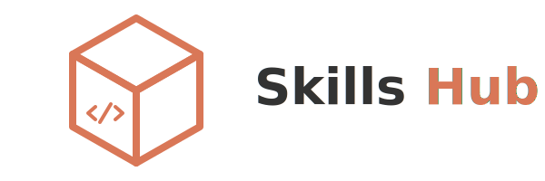
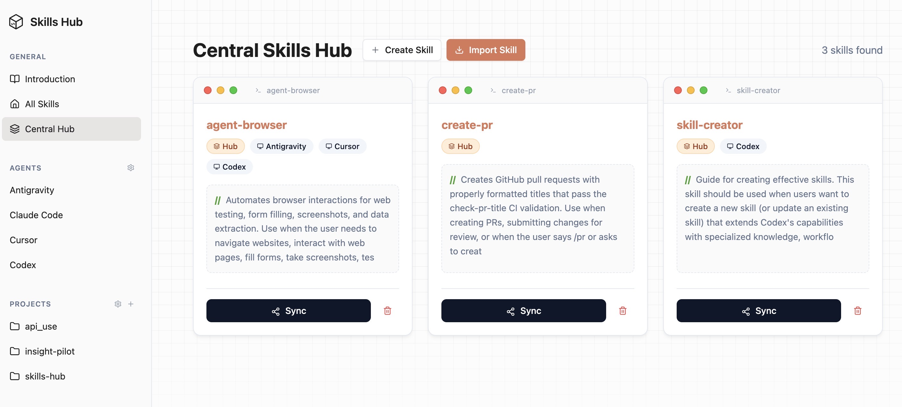

<p align="center">
  
</p>

<p align="center">
  
  
  
  
</p>

<p align="center">
  English | <a href="./README_zh.md">简体中文</a>
</p>

**Skills Hub** is a centralized management tool for AI Agent Skills, providing a unified workflow for discovery, management, and synchronization via **Tauri Desktop** and **CLI**.

|                                                                                                                                                                                                                                                                                                                                                                                                                                          |
| :------------------------------------------------------------------------------------------------------------------------------------------------------------------------------------------------------------------------------------------------------------------------------------------------------------------------------------------------------------------------------------------------------------------------------------------------------------------------------------------------------------- |
| **Skills Hub Desktop UI** is your local control center for AI skills. It allows you to **visually discover and inspect** your skill library, **import new capabilities** directly from GitHub repositories, and **synchronize** them to your favorite coding agents (Antigravity, Claude, Cursor) with a single click—ensuring your agents always have the latest tools without leaving your local environment. It supports both **Copy** (stable) and **Symbolic Link** (live development) synchronization modes. |

## Supported Agents

Skills Hub supports synchronization with a wide range of AI agents, including Antigravity, Claude Code, Cursor, Trae, and [many more](./docs/supported-agents.md).

👉 **[View Full List of Supported Agents & Paths](./docs/supported-agents.md)**

## Project Discovery

- Auto scan is **Git-only**: Scan Roots only add directories that are inside a Git work tree.
- Manual project add is also **Git-only**.
- Path inputs now support a system folder picker first, with manual path input as fallback.

## Download & Installation

### System Requirements

- Node.js 18+ (required for CLI and source builds)
- Rust toolchain (`rustup`) for Desktop (Tauri) source build
- Tauri platform prerequisites for your OS: [Tauri v2 prerequisites](https://v2.tauri.app/start/prerequisites/)

### Option A: App via Homebrew (macOS)

```bash
brew tap PotatoDog1669/skillshub
brew install --cask skills-hub
```

Upgrade:

```bash
brew update
brew upgrade --cask skills-hub
```

### Option B: CLI via Homebrew (macOS/Linux)

```bash
brew tap PotatoDog1669/skillshub
brew install skills-hub
skills-hub --version
```

Upgrade:

```bash
brew update
brew upgrade skills-hub
```

### Option C: CLI via npm

Install globally:

```bash
npm i -g @skillshub-labs/cli
skills-hub --help
```

Run without global install:

```bash
npx @skillshub-labs/cli --help
```

Upgrade:

```bash
npm i -g @skillshub-labs/cli@latest
```

### Option D: Build Desktop App from Source

```bash
git clone https://github.com/PotatoDog1669/skills-hub.git
cd skills-hub
npm ci
npm run tauri:dev
```

Create desktop bundles:

```bash
npm run tauri:build
```

Output directory:
- `src-tauri/target/release/bundle/`

### Releases

- Latest releases: [GitHub Releases](https://github.com/PotatoDog1669/skills-hub/releases)
- Current releases include changelog + source archives (`zipball` / `tarball`).
- Desktop release assets include Homebrew cask-ready DMGs:
  - `skills-hub_X.Y.Z_macos_aarch64.dmg`
  - `skills-hub_X.Y.Z_macos_x64.dmg`

## CLI Command Overview

| Command                                   | Description                                                                     |
| :---------------------------------------- | :------------------------------------------------------------------------------ |
| `skills-hub list` / `skills-hub ls`       | List installed skills (project scope by default; supports `--global`, `--hub`)  |
| `skills-hub remove` / `skills-hub rm`     | Remove installed skills (supports `--all`, `--global`, `--hub`, `--agent`)      |
| `skills-hub import <url>`                 | Import to Hub (supports `--branch`, install mode: `-a/-g/--copy`, and `--list`) |
| `skills-hub sync --all`                   | Sync Hub skills to all enabled agents (Antigravity, Claude, Cursor, etc.)       |
| `skills-hub sync --target <name>`         | Sync to a specific agent (e.g., `--target claude` syncs to `~/.claude/skills/`) |
| `skills-hub provider list`                | List provider profiles (`claude`, `codex`, `gemini`)                            |
| `skills-hub provider add ...`             | Add a provider with `--app --name --config-json` or `--config-file`             |
| `skills-hub provider switch ...`          | Switch current provider with backfill + backup + atomic write                   |
| `skills-hub provider restore ...`         | Restore latest live config backup for an app                                    |
| `skills-hub provider capture ...`         | Capture current live config as an official account provider                     |
| `skills-hub provider universal-add ...`   | Create one universal API provider and sync to multiple apps                     |
| `skills-hub provider universal-list`      | List all universal providers                                                    |
| `skills-hub provider universal-apply ...` | Re-apply a universal provider to enabled apps                                   |
| `skills-hub kit policy-*`                 | Manage AGENTS.md templates (`policy-list/add/update/delete`)                    |
| `skills-hub kit loadout-*`                | Manage skill packages (`loadout-list/add/update/delete`)                        |
| `skills-hub kit add/update/delete/apply`  | Compose Kit and apply it to target project + agent                              |

### Import/List/Remove Quick Examples

```bash
# Import to Hub only (backward compatible)
skills-hub import https://github.com/owner/repo

# List installable skills from remote source only
skills-hub import https://github.com/owner/repo --list

# Import + install to Codex in current project (default mode: symlink)
skills-hub import https://github.com/owner/repo -a codex

# Install globally and copy files instead of symlinks
skills-hub import https://github.com/owner/repo -g -a codex --copy

# Overwrite conflicts without prompt
skills-hub import https://github.com/owner/repo -y

# View global installation or Hub inventory
skills-hub ls --global
skills-hub list --hub

# Remove one installed skill or remove all in selected scope
skills-hub rm my-skill -a codex
skills-hub remove --all -g -a codex
skills-hub remove my-skill --hub
```

### Development

For contributors who want to modify the source code:

```bash
git clone https://github.com/PotatoDog1669/skills-hub.git
cd skills-hub
npm ci
npm run tauri:dev
```

For maintainers, a reusable release notes template is available at:
- `docs/release-notes-template.md`
- `docs/homebrew-tap-setup.md`

## Contributing

We welcome contributions! Please see our [CONTRIBUTING.md](docs/CONTRIBUTING.md) for details on how to get started.

Please adhere to our [Code of Conduct](docs/CODE_OF_CONDUCT.md) in all interactions.

## License

This project is licensed under the MIT License - see the [LICENSE](LICENSE) file for details.
