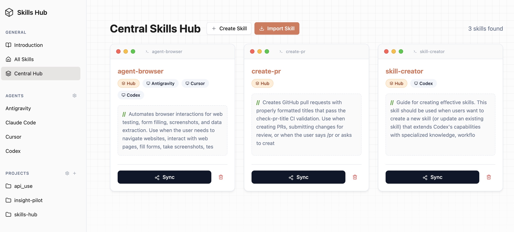

<p align="center">
  
</p>

<p align="center">
  
  
  
  
</p>

<p align="center">
  <a href="./README.md">English</a> | 简体中文
</p>

## 简介

**Skills Hub** 是一个用于 AI Agent 技能管理的中心化工具，提供了统一的 **Tauri 桌面端** 和 **CLI** 工作流，帮助你发现、管理和同步技能。

|                                                                                                                                                                                                                                                               |
| :---------------------------------------------------------------------------------------------------------------------------------------------------------------------------------------------------------------------------------------------------------------------------------------------------------------------------------- |
| **Skills Hub 桌面 UI** 是你的 AI 技能本地控制中心。它允许你**可视化地浏览和检查**技能库，**直接从 GitHub 导入**新功能，并一键**同步**到你喜爱的编码 Agent（如 Antigravity, Claude, Cursor）——确保你的 Agent 始终拥有最新的工具，而无需离开本地环境，也无需依赖云端账户。它支持**复制**（稳定）和**软链接**（实时开发）两种同步模式。 |

## 支持的 Agent

Skills Hub 支持同步到多种主流 AI 编码助手，包括 Antigravity, Claude Code, Cursor, Trae 等以及 **[更多](./docs/supported-agents.md)**。

👉 **[查看完整支持 Agent 列表及路径](./docs/supported-agents.md)**

## 项目发现规则

- 自动扫描为 **仅 Git**：`Scan Roots` 只会纳入位于 Git 工作树内的目录。
- 手动添加项目也为 **仅 Git**。
- 路径输入优先使用系统文件夹选择器，失败时可回退为手动输入路径。

## 下载与安装

### 系统要求

- Node.js 18+（CLI 与源码构建都需要）
- Rust 工具链（`rustup`，用于桌面版 Tauri 源码构建）
- 对应系统的 Tauri 依赖： [Tauri v2 prerequisites](https://v2.tauri.app/start/prerequisites/)

### App 安装（macOS）

```bash
curl -Ls https://potatodog1669.github.io/skills-hub/install.sh | sh
```

升级：

```bash
curl -Ls https://potatodog1669.github.io/skills-hub/install.sh | sh
```

### CLI 安装

#### 通过 Homebrew 安装 CLI（macOS/Linux）

```bash
brew tap PotatoDog1669/skillshub
brew install skills-hub
skills-hub --version
```

升级：

```bash
brew update
brew upgrade skills-hub
```

#### 通过 npm 安装 CLI

全局安装：

```bash
npm i -g @skillshub-labs/cli
skills-hub --help
```

不全局安装直接运行：

```bash
npx @skillshub-labs/cli --help
```

升级到最新版本：

```bash
npm i -g @skillshub-labs/cli@latest
```

### 从源码运行（桌面版）

```bash
git clone https://github.com/PotatoDog1669/skills-hub.git
cd skills-hub
npm ci
npm run tauri:dev
```

构建桌面安装产物：

```bash
npm run tauri:build
```

构建输出目录：
- `src-tauri/target/release/bundle/`

### Releases

- 最新版本发布页： [GitHub Releases](https://github.com/PotatoDog1669/skills-hub/releases)
- 当前 release 默认包含变更说明和源码压缩包（`zipball` / `tarball`）。
- 桌面版 release 资产包含安装用归档包和备用 DMG：
  - `skills-hub_X.Y.Z_macos_aarch64.tar.gz`
  - `skills-hub_X.Y.Z_macos_x64.tar.gz`
  - `skills-hub_X.Y.Z_macos_aarch64.dmg`
  - `skills-hub_X.Y.Z_macos_x64.dmg`

## CLI 命令总览

| 命令                                      | 描述                                                                   |
| :---------------------------------------- | :--------------------------------------------------------------------- |
| `skills-hub list` / `skills-hub ls`       | 列出已安装技能（默认项目级；支持 `--global`、`--hub`）                 |
| `skills-hub remove` / `skills-hub rm`     | 移除已安装技能（支持 `--all`、`--global`、`--hub`、`--agent`）         |
| `skills-hub import <url>`                 | 导入到 Hub（支持 `--branch`，安装模式参数 `-a/-g/--copy`，以及 `--list`） |
| `skills-hub sync --all`                   | 将 Hub 技能同步到所有已启用的 Agent (Antigravity, Claude, Cursor 等)   |
| `skills-hub sync --target <name>`         | 同步到特定 Agent（例如：`--target claude` 同步到 `~/.claude/skills/`） |
| `skills-hub provider list`                | 查看 Provider 档案列表（`claude`、`codex`、`gemini`）                  |
| `skills-hub provider add ...`             | 通过 `--app --name --config-json` 或 `--config-file` 新增 Provider     |
| `skills-hub provider switch ...`          | 执行 Provider 切换（含 backfill + 备份 + 原子写）                      |
| `skills-hub provider restore ...`         | 按 app 恢复最近一次 live 配置备份                                      |
| `skills-hub provider capture ...`         | 将当前 live 配置捕获为“官方账号”Provider                               |
| `skills-hub provider universal-add ...`   | 创建统一供应商并同步到多个 app                                         |
| `skills-hub provider universal-list`      | 查看统一供应商列表                                                     |
| `skills-hub provider universal-apply ...` | 将统一供应商重新同步到已启用 app                                       |
| `skills-hub kit policy-*`                 | 管理 AGENTS.md 模板（`policy-list/add/update/delete`）                 |
| `skills-hub kit loadout-*`                | 管理技能包（`loadout-list/add/update/delete`）                         |
| `skills-hub kit add/update/delete/apply`  | 组合 Kit 并应用到目标项目 + Agent                                      |

### import/list/remove 快速示例

```bash
# 仅导入到 Hub（兼容旧行为）
skills-hub import https://github.com/owner/repo

# 只查看远程可安装技能，不执行导入
skills-hub import https://github.com/owner/repo --list

# 导入并安装到当前项目的 Codex（默认软链接）
skills-hub import https://github.com/owner/repo -a codex

# 安装到全局并使用复制模式
skills-hub import https://github.com/owner/repo -g -a codex --copy

# 冲突时不提示，直接覆盖
skills-hub import https://github.com/owner/repo -y

# 查看全局安装视角或 Hub 视角
skills-hub ls --global
skills-hub list --hub

# 移除安装技能或批量移除
skills-hub rm my-skill -a codex
skills-hub remove --all -g -a codex
skills-hub remove my-skill --hub
```

### 开发指南

如果你想参与贡献或修改源码：

```bash
git clone https://github.com/PotatoDog1669/skills-hub.git
cd skills-hub
npm ci
npm run tauri:dev
```

维护者可复用的 release notes 模板见：
- `docs/release-notes-template.md`
- `docs/homebrew-tap-setup.md`

## 参与贡献

我们欢迎社区贡献！请查看 [CONTRIBUTING.md](docs/CONTRIBUTING.md) 了解如何开始。

所有互动请遵守我们的 [行为准则](docs/CODE_OF_CONDUCT.md)。

## 许可证

本项目采用 MIT 许可证 - 详情请见 [LICENSE](LICENSE) 文件。
